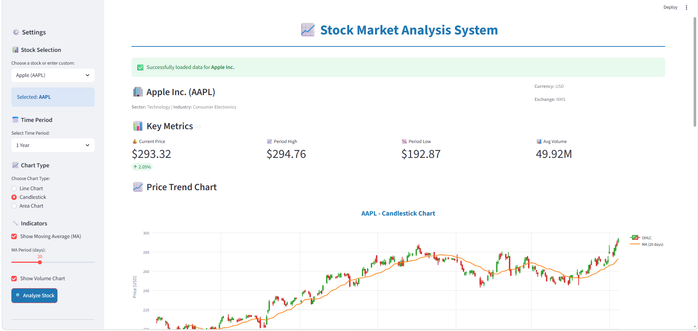
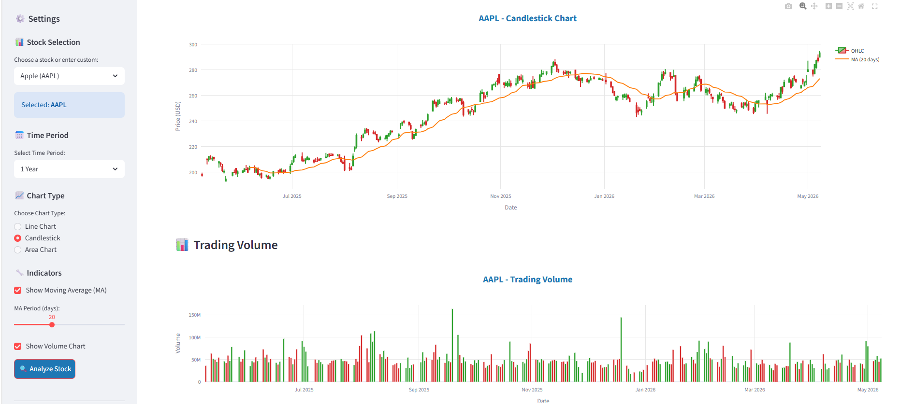
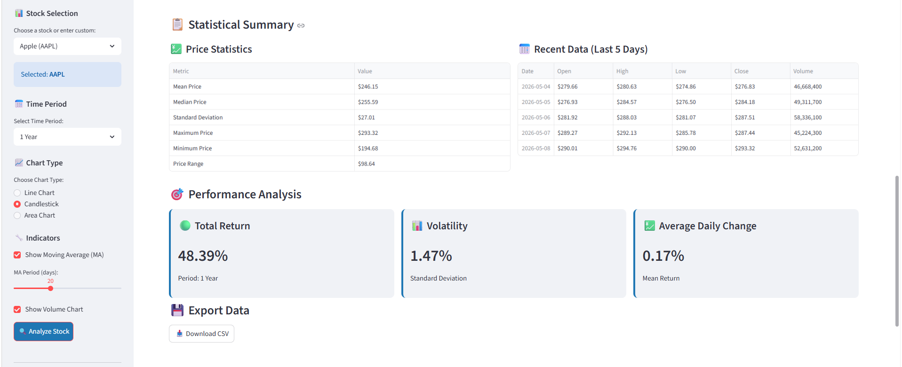
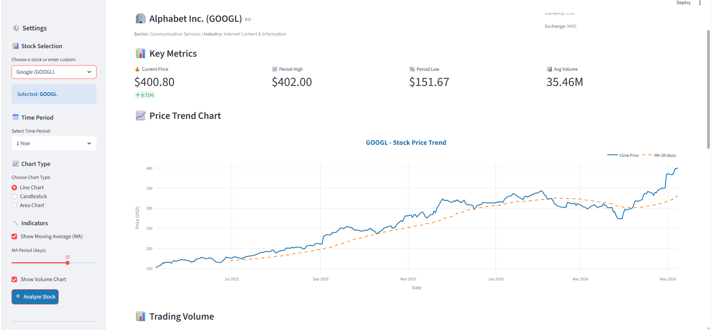

<div align="center">

# 📈 Stock Market Analysis System

### A modern, interactive web application for analyzing stock market data

[](https://www.python.org/)
[](https://streamlit.io/)
[](https://pandas.pydata.org/)
[](https://plotly.com/)

[🚀 Features](#-features) •
[🛠️ Tech Stack](#%EF%B8%8F-tech-stack) •
[⚡ Quick Start](#-quick-start) •
[📸 Screenshots](#-screenshots) •
[👥 Team](#-team)

</div>

---

## 📖 About The Project

**Stock Market Analysis System** is a web-based application built with Streamlit that empowers users to analyze stock market data through an intuitive interface. The system fetches real-time data from Yahoo Finance and provides interactive visualizations, statistical analysis, and technical indicators to help users understand market trends.

This project was developed as part of an academic course under the supervision of **Dr. Khalaf**, demonstrating practical applications of Python, data analysis, and web development.

---

## ✨ Features

- 🔍 **Stock Search** — Quick selection from popular stocks (AAPL, GOOGL, MSFT, TSLA, etc.) or enter any custom symbol
- 📊 **Multiple Chart Types** — Choose between Line, Candlestick, or Area charts
- 📅 **Flexible Time Periods** — Analyze data over 7 days, 1 month, 3 months, 6 months, 1 year, or 5 years
- 📈 **Technical Indicators** — Customizable Moving Averages (5–50 days)
- 💹 **Volume Analysis** — Color-coded volume bars showing trading activity
- 📋 **Statistical Summary** — Mean, median, standard deviation, and volatility metrics
- 🎯 **Performance Analysis** — Total return, average daily change, and volatility insights
- 💾 **Data Export** — Download stock data as CSV for further analysis
- ⚠️ **Smart Error Handling** — Friendly error messages for invalid inputs

---

## 🛠️ Tech Stack

| Technology | Purpose |
|------------|---------|
| **Python 3.9+** | Core programming language |
| **Streamlit** | Web application framework |
| **yfinance** | Yahoo Finance API integration |
| **Pandas** | Data processing & manipulation |
| **Plotly** | Interactive data visualization |
| **NumPy** | Numerical computations |

---

## ⚡ Quick Start

### Prerequisites

- Python 3.9 or higher
- pip (Python package manager)

### Installation

**1. Clone the repository**

```bash
git clone https://github.com/YOUR-USERNAME/Stock-Market-Analysis-System.git
cd Stock-Market-Analysis-System
```

**2. Create a virtual environment (recommended)**

```bash
# Windows
python -m venv venv
venv\Scripts\activate

# macOS/Linux
python3 -m venv venv
source venv/bin/activate
```

**3. Install dependencies**

```bash
pip install -r requirements.txt
```

**4. Run the application**

```bash
streamlit run app.py
```

The app will automatically open in your browser at `http://localhost:8501` 🚀

---

## 📁 Project Structure

```
Stock-Market-Analysis-System/
│
├── app.py                  # Main Streamlit application
├── data_handler.py         # Stock data fetching & processing
├── visualizer.py           # Chart creation module
├── utils.py                # Helper utility functions
├── requirements.txt        # Python dependencies
└── README.md               # Project documentation
```

### Module Responsibilities

| Module | Description |
|--------|-------------|
| `app.py` | Streamlit UI, page layout, and user input handling |
| `data_handler.py` | API calls, data cleaning, and metric calculations |
| `visualizer.py` | Plotly chart generation (Line, Candlestick, Area) |
| `utils.py` | Number formatting and validation helpers |

---

## 📸 Screenshots

### Main Dashboard with Candlestick Chart



### Line Chart with Moving Average



### Candlestick Chart with Volume



### Statistical Summary & Performance Analysis


<!-- Replace these with your actual screenshots -->
<!-- 


-->

---

## 🎮 How to Use

1. **Open the application** in your browser
2. **Select a stock** from the sidebar dropdown OR enter a custom symbol
3. **Choose time period** (7 days, 1 month, 3 months, etc.)
4. **Pick chart type** (Line, Candlestick, or Area)
5. **Configure indicators** (Moving Average, Volume)
6. Click **🔍 Analyze Stock**
7. Explore the interactive charts and statistics
8. **Download** data as CSV if needed

---

## 📊 Sample Stock Symbols

| Symbol | Company |
|--------|---------|
| AAPL | Apple Inc. |
| GOOGL | Alphabet (Google) |
| MSFT | Microsoft |
| AMZN | Amazon |
| TSLA | Tesla |
| META | Meta (Facebook) |
| NFLX | Netflix |
| NVDA | NVIDIA |

---

## 👥 Team

This project was developed by a team of 4 members, each contributing their expertise:

| Name | Student ID | Role | Responsibilities |
|------|-----------|------|-----------------|
| **Mohamed Mahmoud** | 202206860 | Full-Stack Developer | Web app development, API integration, data processing, visualization, UI design |
| **Marwan Hussien** | 202206802 | Full-Stack Developer | Web app development, API integration, data processing, visualization, UI design |
| **Habiba Sherif Mahmoud** | 202206167 | Documentation & Testing | Project documentation, Word report, and application testing with various stock symbols |
| **Mirna Omar** | 202207094 | Presentation & Requirements | PowerPoint presentation design and gathering user interface requirements |

---

## 🎓 Academic Context

This project was developed under the supervision of **Dr. Khalaf** as part of academic coursework. It demonstrates:

- ✅ Modular software architecture
- ✅ Real-world API integration
- ✅ Data processing & analysis
- ✅ Interactive data visualization
- ✅ Web application development
- ✅ Team collaboration & version control
- ✅ Software testing & documentation

---

## 🚀 Future Enhancements

- [ ] Multi-stock comparison feature
- [ ] Advanced technical indicators (RSI, MACD, Bollinger Bands)
- [ ] Portfolio management functionality
- [ ] Price prediction using machine learning
- [ ] Real-time alerts for price movements
- [ ] User authentication and saved watchlists
- [ ] Mobile-responsive design

---

## 📝 License

This project is created for educational purposes.

---

## 🙏 Acknowledgments

- **Dr. Khalaf** — For the guidance and supervision throughout this project
- **Yahoo Finance** — For providing free access to stock market data
- **Streamlit Team** — For creating an amazing framework
- **Open Source Community** — For the incredible Python libraries

---

<div align="center">

### ⭐ If you found this project helpful, please consider giving it a star!

**Built with ❤️ by Project Team**

</div>
